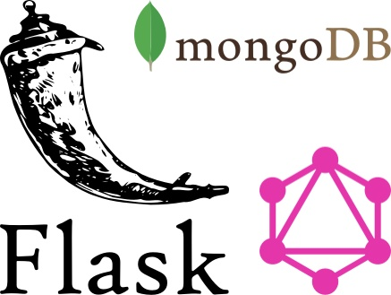
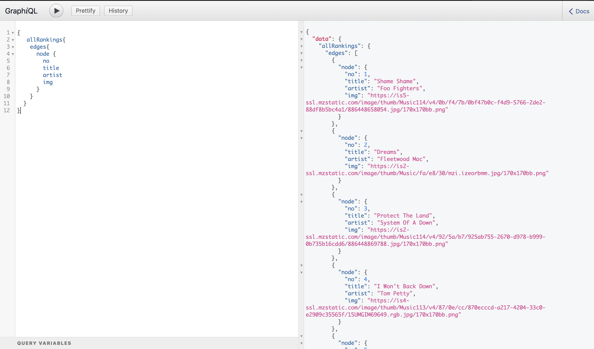

# GraphQL with Flask and MongoDB

I created this backend program to utilize graphQL for a single endpoing with Flask and MongoDB.
This system will fetch Top100 rock songs from [PopVortex](http://www.popvortex.com/music/charts/top-rock-songs.php) by scraping and store them in MongoDB.


## How to start this application

* Python3 (Using 3.6.6 in this project)

## Installation

You can download this project by using following command.
```bash
git clone https://github.com/hiroki0116/Flask-Graphql-MongoDB
```

Navigate to the appropriate directry.
```bash
cd Flask-Graphql-MongoDB
```

Install the essential dependencies.
```bash
pip install -r requirements.txt
```

Launch the local server
```bash
python app.py
```

Go to graphQL IDE [http://127.0.0.1:5000/graphql](http://127.0.0.1:5000/graphql)

Insert the following default query
```bash
{ 
   allRankings{
    edges{
      node {
        no
        title
        artist
        img
      }
    }
  }
}
```




